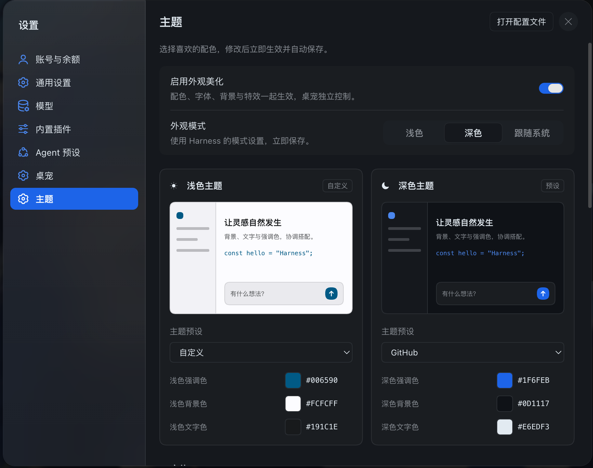
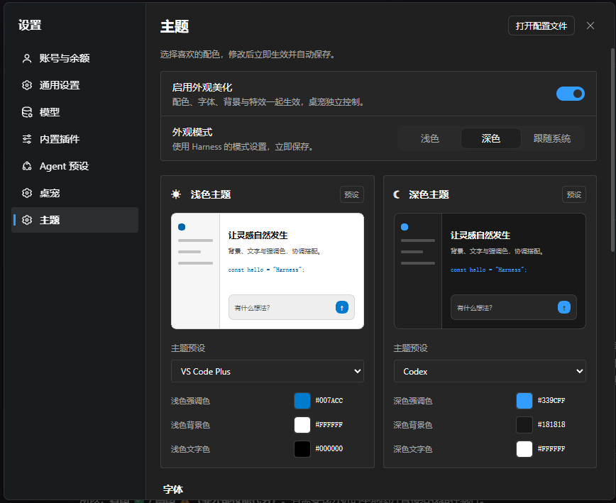

<h1 align="center">🐋 dsh-cyberwhale</h1>

<p align="center">
  <strong>让 DeepSeek Harness 更融入你的 macOS 和 Windows</strong>
</p>

<p align="center">
  双端视觉本地化 · 主题配色 · 壁纸与字体 · 可选蓝鲸桌宠
</p>

<p align="center">
  <a href="LICENSE"></a>
  
  
</p>

<p align="center">
  <a href="#界面预览">界面预览</a> ·
  <a href="#为什么需要-cyberwhale">为什么需要它</a> ·
  <a href="#能做什么">功能介绍</a> ·
  <a href="#快速上手">快速上手</a> ·
  <a href="#可选的蓝鲸桌宠">蓝鲸桌宠</a> ·
  <a href="#常见问题">常见问题</a>
</p>

---

## 界面预览

同一套功能，两种熟悉的系统风格。下面是 macOS 与 Windows 上的实机截图，点击图片可查看大图。

<table>
  <tr>
    <th width="50%"> macOS · 系统设置风格</th>
    <th width="50%"> Windows · WinUI 3 风格</th>
  </tr>
  <tr>
    <td valign="top">
      <a href="docs/images/settings-macos.png"></a>
    </td>
    <td valign="top">
      <a href="docs/images/settings-windows.png"></a>
    </td>
  </tr>
  <tr>
    <td align="center">磨砂侧栏、圆角分组、小型开关</td>
    <td align="center">导航指示条、设置卡片、小圆角控件</td>
  </tr>
</table>

喜欢这种外观？[几步安装并启用](#快速上手)，再搭配自己的主题、壁纸和字体。

## 为什么需要 CyberWhale？

DeepSeek Harness 提供了一个好用的 AI 工作环境，但它的界面与 macOS、Windows 各自的系统风格仍有一些距离：设置面板、导航和开关，和你每天使用的系统界面不太协调。

CyberWhale 为 Harness 做了一套**双端视觉本地化**，参考两套系统各自熟悉的界面样式，让软件在视觉上更融入你的桌面：

-  **在 macOS 上**，设置页采用系统设置风格的圆角分组、小型开关和磨砂侧栏。
-  **在 Windows 上**，设置页参考 WinUI 3 的导航、设置卡片、圆形开关滑块和材质层次。
- 🎨 **在两端都能个性化**，选择主题、更换壁纸、调整字体，搭配自己的工作环境。

插件会自动识别客户端系统，使用对应的设置界面。配色、字体和背景功能在两端共享，蓝鲸桌宠可以单独开启或关闭。

> 这里的“视觉本地化”指系统风格适配。设置界面通过 CSS 模拟 macOS 与 WinUI 3 的视觉效果；磨砂侧栏和输入框是 Web 效果。macOS 上可选的桌宠气泡 Liquid Glass 使用原生材质。

## 能做什么？

| 功能 | 你能得到什么 |
| --- | --- |
|  **macOS 风格设置界面** | 圆角分组、细分隔线、小型开关、磨砂侧栏，以及随当前分区变化的标题 |
|  **Windows WinUI 3 风格设置界面** | 带强调色指示条的导航、设置卡片、小圆角控件与 Mica 风格的底色层次 |
| 🎨 **27 个浅深色主题选项** | 浅色 10 个、深色 17 个，包含 Catppuccin、Nord、Dracula、Tokyo Night 等配色与蓝鲸原创主题 |
| 🖌️ **自定义配色** | 分别调整浅色和深色模式的强调色、背景色、文字色，自动派生界面表面和边界颜色 |
| 🖼️ **纯色、渐变与图片背景** | 三套渐变或自己的 PNG、JPEG、WebP 图片；可调整图片布局、背景遮罩和图片模糊 |
| 🌈 **从壁纸生成配色** | 提取图片中的候选主色，选择后生成配套的浅色与深色方案 |
| 🔤 **界面与代码字体** | 读取本机字体，分别选择界面字体和代码字体；正文字号沿用 Harness 的设置 |
| **磨砂与阅读设置** | 可开启输入框磨砂，或减少透明效果、使用实色表面 |
| 💾 **立即生效与自动保存** | 调整后直接看到变化，设置自动保存，重新打开后继续使用 |
| 🐋 **可选蓝鲸桌宠** | 随任务切换动作、显示进度气泡，也能拖动、打招呼和跟随鼠标注视 |

浅色、深色或跟随系统均可选择，两种模式分别保留自己的配色。配色来源和许可见 [主题预设说明](docs/theme-presets.md)。

### 使用前你可能想知道

| | 说明 |
| --- | --- |
| **免费开源** | MIT 许可，可以查看源码、修改和贡献 |
| **外观和桌宠分别控制** | 可以只使用外观美化，也可以单独保留桌宠 |
| **本机保存** | 插件主题配置和导入的壁纸保存在本机；图片导入后会复制到插件数据目录 |
| **使用现有 Harness** | 无需修改 Harness 安装包，保留原有设置操作和控件交互 |
| **随时恢复外观** | 关闭“启用外观美化”，撤销插件的设置样式、主题配色、字体和背景覆盖 |

## 快速上手

需要安装并启动过一次 [DeepSeek Harness 官方 Desktop](https://github.com/deepseek-ai/deepseek-harness)。当前基于 Harness Desktop **0.2.0-rc.2** 验证。

### 1. 安装并启用插件

打开 Harness：**侧栏 → 插件 → 添加插件**，选择一种安装方式：

| 安装方式 | 填入内容 |
| --- | --- |
| npm 包名 | `dsh-cyberwhale` |
| 仓库地址 | `https://github.com/CyberWei922/dsh-cyberwhale` |
| Release 压缩包 | [Releases](https://github.com/CyberWei922/dsh-cyberwhale/releases) 中 `.tgz` 的下载直链或本地路径 |

插件卡片名称为 **Harness 美化与桌宠**。安装完成后点击**立即启用**。如果没有出现新增的设置页，完全退出并重新打开 Harness。

> **1.0 正式版**包含双端视觉本地化、主题、壁纸与字体功能。当前修正版为 **1.0.1**，同步更新了插件卡片的名称和介绍；从旧版升级时，请指定 `dsh-cyberwhale@1.0.1`，升级方法见下方常见问题。

应用内安装无需额外安装 Node.js。只有命令行安装或开发才需要 Node.js 22+；从仓库安装还需要可用的 `git`。

### 2. 打开主题设置

进入 **设置 → 主题**，开启“启用外观美化”：

1. 选择浅色、深色或跟随系统。
2. 分别选择浅色、深色主题，也可以自定义三种基础色。
3. 根据喜好选择界面字体和代码字体。
4. 在“背景”中选择纯色、渐变或图片。
5. 按需要开启输入框磨砂，或减少透明效果。

**修改立即生效并自动保存。** macOS 和 Windows 会自动使用各自的设置界面，无需手动选择平台样式。

### 3. 按喜好搭配

| 想要的效果 | 可以这样设置 |
| --- | --- |
| 接近系统界面的简洁外观 | 使用纯色背景和系统默认字体，开启平台设置样式 |
| 熟悉的编辑器配色 | 选择 Catppuccin、Nord、Tokyo Night 等主题，并搭配自己的代码字体 |
| 壁纸与界面颜色协调 | 上传图片，展开“从图片生成配色”，选择一个主色应用配套方案 |
| 更清楚的阅读表面 | 提高背景遮罩，或开启“减少透明效果” |
| 有任务状态陪伴 | 到“设置 → 桌宠”开启蓝鲸和气泡提示 |

<details>
<summary>命令行或本地开发安装</summary>

先完全退出 Harness，再安装本地目录。以下命令使用官方默认安装位置，自定义安装请替换路径。

```bash
git clone https://github.com/CyberWei922/dsh-cyberwhale.git
cd dsh-cyberwhale
npm ci
npm run build:client
```

macOS：

```bash
"/Applications/DeepSeek Harness.app/Contents/Resources/runtime/cli/bin/dsh" \
  plugin --profile desktop add "$PWD"
```

Windows PowerShell：

```powershell
& "$env:LOCALAPPDATA\Programs\DeepSeek Harness\resources\runtime\cli\bin\dsh.cmd" `
  plugin --profile desktop add "$($PWD.Path)"
```

这种方式用 `link:` 指向工作目录，适合开发。客户端源码修改后重新构建，再刷新或重启 Harness。

</details>

## 支持的平台

| 平台 | 设置界面 | 主题、壁纸与字体 | 蓝鲸桌宠 |
| --- | --- | --- | --- |
| macOS | macOS 系统设置风格 | 支持 | 支持；macOS 26+ 可选原生气泡 Liquid Glass |
| Windows 11 x64 | WinUI 3 风格 | 支持 | 支持，使用普通气泡 |

新版已在 macOS 和 Windows 11 x64 上确认日常使用正常。其他 Windows 版本、Windows ARM64 和 Linux 尚未完成验证；桌宠的混合 DPI 跨屏拖拽、显示器热插拔等边界场景见 [Windows 验证范围](docs/windows-adaptation.md#5-明确未验证的部分)。

## 可选的蓝鲸桌宠

一只随 Harness 工作状态变化的蓝色大肥鱼：任务开始时工作，等待确认时停下来，完成后跳跃庆祝。气泡显示会话标题和当前任务进度，待机时安静陪伴。


*透明桌面窗口中的招手动作。*

| 操作 | 效果 |
| --- | --- |
| 设置 → 桌宠 → 启用桌宠 | 显示或隐藏蓝鲸 |
| 按住身体拖动 | 移动桌宠，记住位置 |
| 右键 → 打个招呼 | 播放招手动画 |
| 设置 → 桌宠 → 显示大小 | 调整桌宠大小 |
| 设置 → 桌宠 → 气泡提示 | 显示或隐藏任务气泡 |
| 设置 → 桌宠 → 眼睛跟随鼠标 | 控制待机时的鼠标注视 |
| 设置 → 桌宠 → 重置位置 | 找回移到边缘的桌宠 |

眼睛跟随仅在待机、鼠标停在身体上时生效，最多持续 10 秒。退出 Harness 时桌宠一起退出。多个会话共用桌宠状态。

### 桌宠运行环境

外观美化在 Harness 内运行；**桌宠需要额外的独立 Electron 运行时**。本机已有可用缓存时自动复用，没有时到 **设置 → 桌宠 → 准备运行时** 下载，压缩包约 100–150 MB。

下载源可选国内镜像（默认，npmmirror）或官方源。准备完成后开启桌宠即可；只使用外观美化时，可以关闭桌宠并跳过运行时准备。

在 macOS 26 及以上，可单独开启“气泡液态玻璃”。Windows、旧版 macOS 及系统减少透明等不支持条件下使用普通气泡。

## 设计理念

**首先贴近系统，再留出个性化的空间。**

两端采用各自熟悉的导航、控件比例和材质层次，共用主题、壁纸和字体设置。用户不必迁就一套与桌面风格差异很大的界面，也可以按个人习惯调整配色和阅读环境。

- **保留操作习惯**：沿用 Harness 的设置入口和控件行为，保持键盘操作与焦点反馈。
- **把内容看清楚**：为文字和控件调整颜色对比度，提供背景遮罩与减少透明设置。
- **功能各取所需**：外观美化与桌宠分别控制，配置在本机保存。
- **保留退出方式**：关闭外观美化撤销视觉覆盖，关闭桌宠结束它的独立窗口。

## 常见问题

### 可以只美化界面，不使用桌宠吗？

可以。在“设置 → 主题”开启外观美化，在“设置 → 桌宠”关闭桌宠即可。桌宠运行时只用于桌宠功能。

### 设置里没有“主题”或“桌宠”？

确认插件已安装并启用，然后完全退出、重新打开 Harness。只关闭主窗口可能没有结束后台进程。

### 开启后效果不明显，或者新版功能没有出现？

检查“启用外观美化”是否打开，以及当前安装的插件版本是否包含新版功能。其他主题插件也可能覆盖配色，排查时先单独启用 CyberWhale。客户端更新后需要刷新或重启 Harness。

### 磨砂和 Liquid Glass 都是原生效果吗？

设置侧栏、聊天背景和输入框的磨砂使用 Web CSS 实现；Windows 的 Mica 风格底色也是视觉模拟。macOS 26+ 的桌宠气泡 Liquid Glass 使用 Apple 原生材质，可独立开启。

### 如何更新或恢复官方外观？

在插件页卸载后重新安装新版，再完全重开 Harness。刚发布的版本可按 [更新说明](docs/distribution.md#历史这些坑已经踩过并解决了) 指定版本安装。

关闭“设置 → 主题 → 启用外观美化”会撤销插件的视觉覆盖；Harness 自己的外观模式和正文字号继续保留。桌宠有独立开关。

### 设置和壁纸保存在哪里？

默认位于 macOS 的 `~/.dsh/dsh-cyberwhale/`，或 Windows 的 `%USERPROFILE%\.dsh\dsh-cyberwhale\`。如果设置了 `DSH_HOME`，则使用该目录下的 `dsh-cyberwhale/`。

主题设置保存在 `appearance.json`，桌宠设置保存在 `settings.json`，导入的图片保存在 `wallpapers/`。图片导入后不依赖原文件位置，浅深模式共用一张壁纸。

### 桌宠没有出现，或准备运行时失败？

查看“设置 → 桌宠”的运行状态和错误提示。缺少运行环境时点击“准备运行时”，下载失败时尝试更换下载源；位置异常时点击“重置位置”。详见 [使用与排障](docs/usage.md) 和 [Windows 安装指南](docs/windows-install.md)。

## 反馈与贡献

遇到问题，欢迎提交 [Issue](https://github.com/CyberWei922/dsh-cyberwhale/issues)，附上系统版本、Harness 版本、插件版本、复现步骤和截图。

欢迎贡献主题、平台样式和问题修复。开发资料见 [开发指南](docs/development.md)、[Windows UI 开发说明](docs/windows-ui-development.md) 和 [分发与发布](docs/distribution.md)。

如果这个插件让你的 Harness 用起来更舒服，欢迎给项目一个 Star 🐋

## 许可与致谢

本项目采用 [MIT License](LICENSE)。配色预设、图片取色等第三方内容见 [第三方声明](THIRD_PARTY_NOTICES.md) 和 [许可文件](LICENSES)。

感谢 [DeepSeek Harness](https://github.com/deepseek-ai/deepseek-harness) 提供的插件与主题接口，以及各开源主题作者提供的配色。
